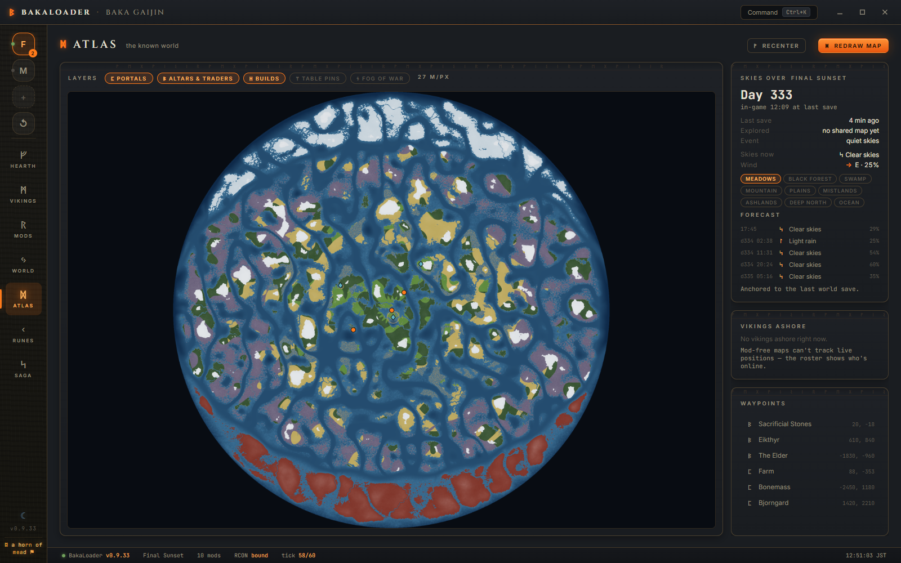

<h1 align="center">Valheim BakaLoader</h1>

  <em>Run your modded Valheim server from one window. Mods, restarts, players, and a live map of your actual world.</em>

  
  
  
  
  

  <a href="https://github.com/RyanDMcAfee/ValheimBakaLoader/releases/latest"><b>ᛞ Download the latest release</b></a>
  &nbsp;·&nbsp; unzip &nbsp;·&nbsp; run <code>ValheimBakaLoader.exe</code>. No installer, no command line. A first-launch wizard walks you through the rest.

  

> **Disclaimer:** A fan-made project, not affiliated with Valheim or Iron Gate Studio. Use at your own risk.

---

## Why this exists

I run a heavily modded server for friends, and for a long time that meant batch files, a console window nobody was allowed to close, and finding out at breakfast that the server died at 2am. BakaLoader is the app I wanted instead. It starts and stops the world, keeps mods current from Thunderstore, restarts on a schedule (after warning the players in-game first), shows who's online, and draws a map of your actual world without needing a single map mod installed.

Everything lives in seven halls:

| ᚠ **Hearth** | ᛗ **Vikings** | ᚱ **Mods** | ᛃ **World** |
|:---:|:---:|:---:|:---:|
| Live dashboard | Player roster | Thunderstore scan & update | Settings, seed, modifiers |
| **ᛞ Atlas** | **ᚲ Runes** | **ᛋ Saga** | |
| Your world, mapped | Config file editor | Live server log | |

---

## The Atlas

  

BakaLoader renders your world map straight from the seed, on your PC, with no mods on the server. Fog of war comes from what your players have actually explored (anything shared at a cartography table counts for everyone). Portals, player builds, traders, and your own waypoints sit on top as toggleable layers.

The sidebar knows what day it is in-game and what the weather is doing, including the next several weather changes and their wind. Valheim's weather is deterministic, so once you know the world time the forecast is just math. Handy before a long sail.

---

## A look inside

<table width="100%">
  <tr>
    <td width="50%" valign="top">
      
      
<strong>ᛗ Vikings</strong> — who's on, when they joined, and a right-click menu for everything else.

    </td>
    <td width="50%" valign="top">
      
      
<strong>ᚱ Mods</strong> — scan Thunderstore, update everything in one click, or paste a mod link to install it.

    </td>
  </tr>
  <tr>
    <td width="50%" valign="top">
      
      
<strong>ᛃ World</strong> — name, password, seed, crossplay, backups, and the vanilla world-modifier dials.

    </td>
    <td width="50%" valign="top">
      
      
<strong>ᚲ Runes</strong> — edit your mods' config files right in the app.

    </td>
  </tr>
  <tr>
    <td width="50%" valign="top">
      
      
<strong>ᛋ Saga</strong> — the live server log with the debug noise stripped out, plus a console line at the bottom.

    </td>
    <td width="50%" valign="top">
      
      
<strong>Command palette</strong> — <kbd>Ctrl</kbd>+<kbd>K</kbd> from anywhere. Restart, kick, broadcast, save, whatever you need.

    </td>
  </tr>
</table>

---

## What it does

### Running the server
- Start, stop, and restart from the app. Settings persist between sessions and Steam can't clobber them.
- Scheduled restarts (every 6 hours by default) with an in-game countdown so nobody gets dropped mid-fight without warning. There's also an optional restart when the last player logs off, and auto-relaunch if the server crashes.
- The server process is tied to the app. Close BakaLoader, kill it from Task Manager, even bluescreen — the server won't linger as an orphan eating your RAM. And if you relaunch while a matching server is already up, BakaLoader adopts it instead of spawning a second one.
- Closing the app while players are online warns you first, then saves the world properly on the way out.
- Copy your IP or crossplay invite code from the dashboard. Minimize to tray if you want it out of the way.
- Raise the player cap past vanilla's 10 from the World hall.

### More than one server
Each server gets its own profile, and profiles can be fully isolated: separate install, separate mods, separate save folder. Switching between them is one click in the sidebar. The new-server wizard finds a free port for you and warns about collisions (two servers on one port, two servers writing the same world) before they happen. If you've got orphaned worlds from an old setup, BakaLoader can adopt them — it copies the files and leaves your originals alone.

### Mods
- Scans your BepInEx folder and checks every mod against Thunderstore. Out-of-date ones get an UPDATE pill; updating is one click each, or one click for all of them.
- Paste any Thunderstore link to install a mod. Pinned versions work too.
- Right-click to remove a mod's files.
- Columns sort properly, including by version.

### Players
- Live roster with join times, and last-seen for whoever's offline. Steam and Xbox players both show up.
- Right-click a player to promote, permit, kick, ban, heal, smite, or teleport them, or to copy their ID.
- "Spawn at player" opens a searchable item and creature picker that knows about your installed mods' items too.
- Broadcast a message to everyone on the server.

### The small stuff
- Updates itself. When a new release is out, BakaLoader can swap itself during a scheduled restart, or you can trigger it from the Upkeep card.
- Not into the Norse theming? There's a plain-terminology toggle that renames everything to ordinary labels.
- Start with Windows, if you want the server up whenever the machine is.
- Config validation stops you from launching with settings that would just fail.

---

## Requirements

- **Windows 10 or 11 (x64).** Other setups might work, but this is what I test on.
- **[.NET 6 Desktop Runtime](https://dotnet.microsoft.com/download/dotnet/6.0).** You'll be prompted on first run if it's missing (look for ".NET Desktop Runtime 6.X.X").
- **Valheim Dedicated Server.** Free with your copy of Valheim; see the [Valheim Wiki install guide](https://valheim.fandom.com/wiki/Dedicated_servers).

---

## Quick start

1. **[Download the latest release](https://github.com/RyanDMcAfee/ValheimBakaLoader/releases/latest)**, unzip it anywhere, and launch **`ValheimBakaLoader.exe`**. The setup wizard runs on first launch and covers most of this.
2. In the **World** hall, set a **Server Name** and **Password**. The default port is fine for most people.
3. Pick an existing world to host, or type a new world name (you can set the seed too).
4. Join options:
   - **Community Server** lists your server in the in-game browser.
   - **Enable Crossplay** lets players on any platform join with an invite code.
5. Hit **Start Server**. When the status reads **Running**, you're live. Copy your IP or invite code and send it to your friends.

### Remote control (optional)

In-game broadcasts, the restart countdown, and the heal / smite / teleport / spawn actions all talk to the server over **RCON**. The first time you use one, BakaLoader detects the required RCON mods and offers to install them from Thunderstore. Accept the prompt and you're set.

### Opening your server to friends

If friends can't connect over the internet, you'll usually need to **forward the server's ports** on your router and allow it through **Windows Firewall**.

<table width="100%">
  <tr>
    <td width="50%"></td>
    <td width="50%"></td>
  </tr>
</table>

---

## Anonymous usage stats

BakaLoader sends a tiny anonymous heartbeat (roughly every 5 minutes while the app is open) so I can see how many installs are out there and how many servers are online. It contains exactly three things:

- a **one-way hashed device ID** (cannot be reversed into your machine name or hardware),
- the **app version**,
- whether a **server is currently running** (true/false).

No IP addresses, no server names, no passwords, no world data, no player information, ever. You can switch it off at any time with the **"Share anonymous usage stats"** toggle in the Hearth's **Upkeep** card.

---

## Mod authors

Want your mod supported by BakaLoader (item picker entries, config editing, update tracking)? [Open an issue](https://github.com/RyanDMcAfee/ValheimBakaLoader/issues) with your mod's Thunderstore link and what you'd like supported. That's the fastest way to reach me.

BakaLoader is a solo project and does not accept code contributions or pull requests.

## License

Valheim BakaLoader is free to download and use, under the **BakaLoader Source-Available License**: run it for any server (personal or community, donations included) and read the source freely. Redistribution and derivative works are not permitted. See the [LICENSE](LICENSE) file for the full terms.

Valheim is a trademark of Iron Gate AB. This project is an independent, unofficial tool and is not affiliated with or endorsed by Iron Gate AB.
