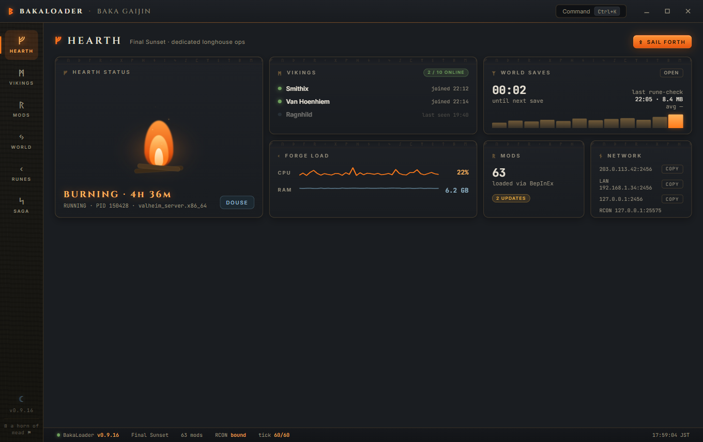
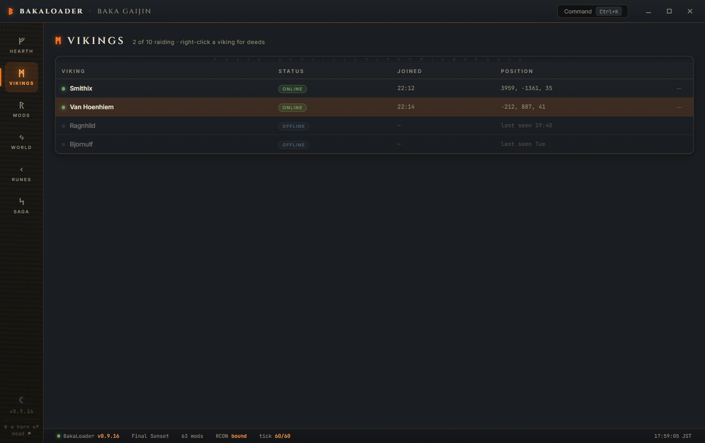
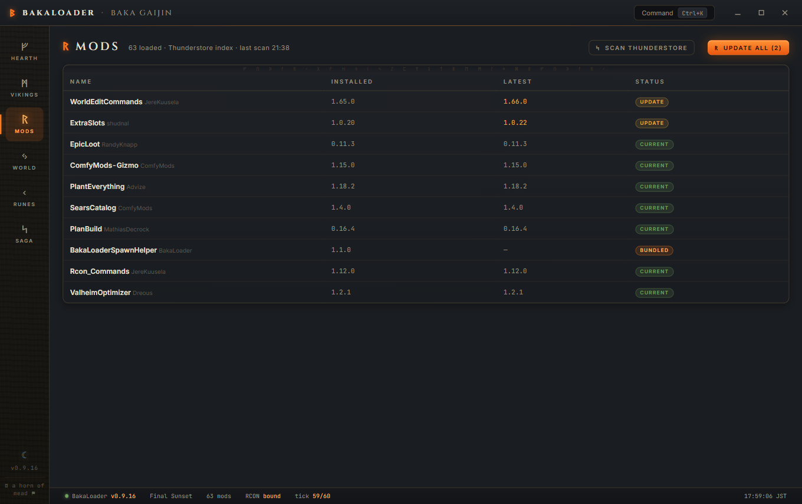
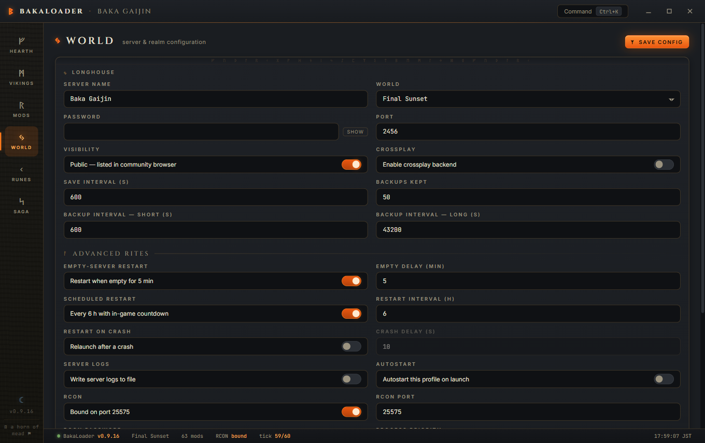
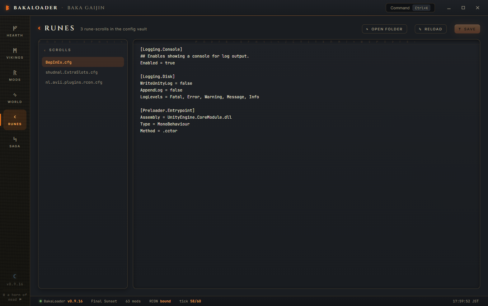
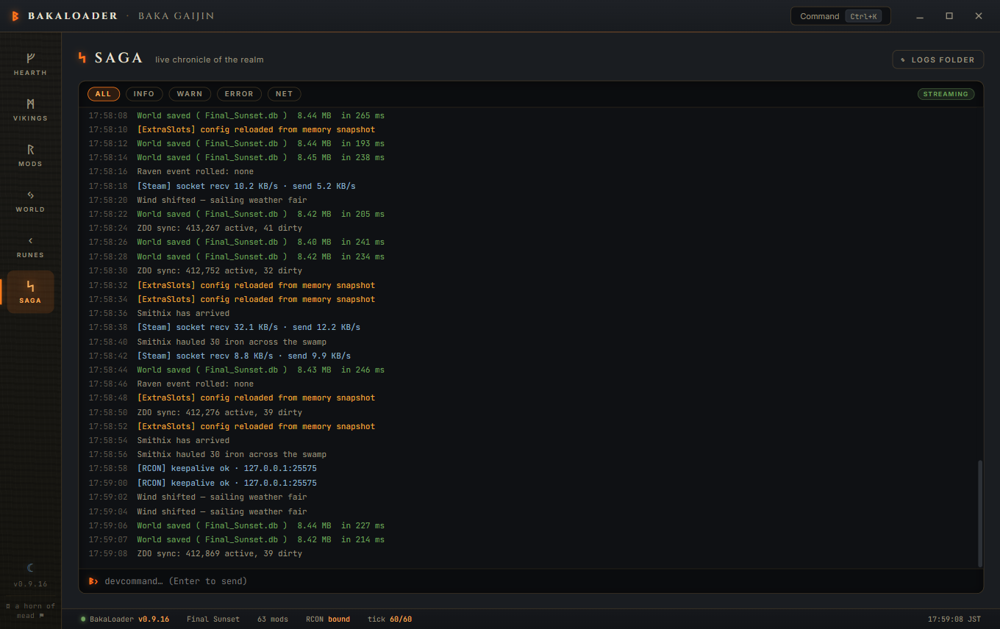
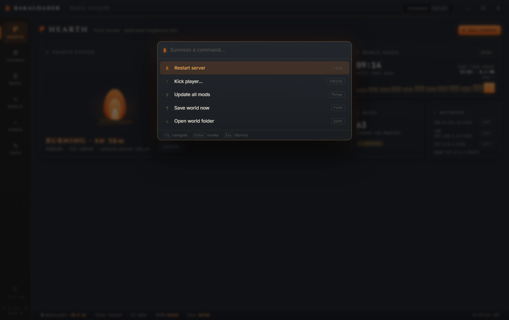
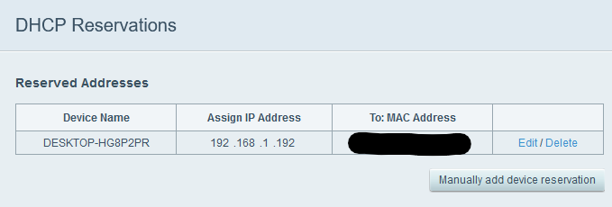
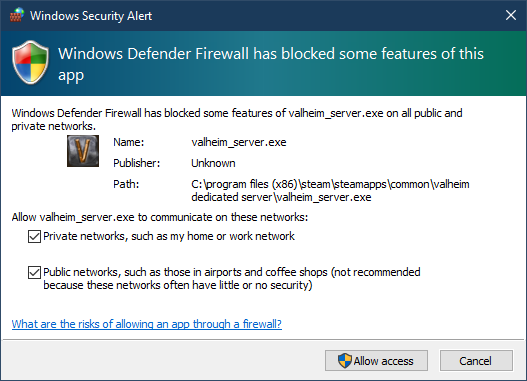

<h1 align="center">Valheim BakaLoader</h1>

  <em>A modern control room for your Valheim dedicated server: mods, uptime, and remote control, all from one window.</em>

  
  
  
  
  

  <a href="https://github.com/RyanDMcAfee/ValheimBakaLoader/releases/latest"><b>ᛞ Download the latest release</b></a>
  &nbsp;·&nbsp; unzip &nbsp;·&nbsp; run <code>ValheimBakaLoader.exe</code> and your world is up in minutes. No installer, no command line.

  

> **Disclaimer:** A fan-made project, not affiliated with Valheim or Iron Gate Studio. Use at your own risk.

---

## Why BakaLoader?

Running a modded Valheim server on Windows usually means a tangle of batch files, a console window you can't close, and a lot of hoping nothing crashes while you sleep. **BakaLoader replaces all of that with a single, purpose-built app.** Start and stop your world, keep mods current from Thunderstore, watch who's online, edit config files, and manage players, all without touching a command line.

The interface is Norse-themed and organised into six halls:

| ᚠ **Hearth** | ᛗ **Vikings** | ᚱ **Mods** |
|:---:|:---:|:---:|
| Live server dashboard | Who's online, right now | Scan & update from Thunderstore |
| **ᛃ World** | **ᚲ Runes** | **ᛋ Saga** |
| Server settings & rites | In-app config editor | Live server log stream |

---

## A look inside

<table width="100%">
  <tr>
    <td width="50%" valign="top">
      
      
<strong>ᛗ Vikings</strong>: see who's online, when they arrived, and manage them with a right-click.

    </td>
    <td width="50%" valign="top">
      
      
<strong>ᚱ Mods</strong>: scan Thunderstore and update every installed mod in one click.

    </td>
  </tr>
  <tr>
    <td width="50%" valign="top">
      
      
<strong>ᛃ World</strong>: name, password, crossplay, RCON, restarts, and directories.

    </td>
    <td width="50%" valign="top">
      
      
<strong>ᚲ Runes</strong>: browse and edit your mods' config files without leaving the app.

    </td>
  </tr>
  <tr>
    <td width="50%" valign="top">
      
      
<strong>ᛋ Saga</strong>: a clean, live stream of your server's log, free of debug noise.

    </td>
    <td width="50%" valign="top">
      
      
<strong>ᚴ Command palette</strong>: press <kbd>Ctrl</kbd>+<kbd>K</kbd> to run anything, instantly.

    </td>
  </tr>
</table>

---

## Features

### ᚠ Server management
- **It remembers.** Your server settings persist between sessions and can't be clobbered by Steam.
- **Clear status.** Always know whether your server is running, starting, or stopping.
- **Easy IP sharing.** Copy the correct address (or crossplay invite code) straight from the app.
- **Cleaner logs.** Strips the noisy debug output the server normally spews.
- **Input validation.** Stops you from launching a server with settings that would fail.
- **Multi-server support.** Run several servers at once via separate profiles.
- **Minimize to tray.** Tuck the app away and control the server from the system tray.
- **Command palette.** <kbd>Ctrl</kbd>+<kbd>K</kbd> for restart, kick, update, save, and more.

### ᛏ Reliability & safe shutdowns
- **Safe shutdowns.** Cleanly stops the server when you close the app or shut down Windows.
- **Guaranteed cleanup.** The server is tied to the app, so it never lingers as an orphan, even after a crash or a Task Manager kill.
- **Orphan detection.** On launch, re-adopts an already-running server that matches your profile instead of spawning a duplicate.
- **Auto-restart on crash.** Optionally relaunch the server if it goes down.
- **Empty-server restart.** Optionally restart when the last player leaves, to keep things fresh.
- **Scheduled restarts.** Optionally restart on a fixed schedule (e.g. every 6 hours).
- **In-game countdown.** Warns connected players over RCON before a scheduled restart.

### ᚱ Mods
- **Mod scanning.** Lists every mod installed on your server at a glance.
- **One-click updates.** Checks Thunderstore for newer versions and updates them for you.
- **Right-click removal.** Delete a mod's files directly from the Mods hall.
- **Required-mod helper.** Detects the RCON mods BakaLoader needs and offers to install them.
- **Server-side mod tested.** Built and verified against real modded servers.

### ᛗ Players
- **Live roster.** See who's online or offline, and when they came and went.
- **Cross-platform.** Recognises players from both Steam and Xbox.
- **Right-click management.** Promote, permit, kick, ban, heal, smite, teleport, copy ID, or view details.
- **Spawn at player.** A searchable, mod-aware item & creature picker drops things onto a chosen player.
- **Broadcasts.** Send an in-game message to everyone on the server.

### ᚲ Config editor
- **Edit in place.** Browse and edit your installed mods' config files without ever leaving BakaLoader.

---

## Requirements

- **Windows 10 or 11 (x64).** Other configurations may or may not work.
- **[.NET 6 Desktop Runtime](https://dotnet.microsoft.com/download/dotnet/6.0).** You'll be prompted to install it on first run if it's missing (look for ".NET Desktop Runtime 6.X.X").
- **Valheim Dedicated Server.** Free with your copy of Valheim; see the [Valheim Wiki install guide](https://valheim.fandom.com/wiki/Dedicated_servers).

---

## Quick start

1. **[Download the latest release](https://github.com/RyanDMcAfee/ValheimBakaLoader/releases/latest)**, unzip it anywhere, and launch **`ValheimBakaLoader.exe`**.
2. In the **World** hall, enter a **Server Name** and **Password**. The default port is fine for most people.
3. Choose an existing world to host, or type a new world name.
4. Pick your join options:
   - **Community Server** lists your server in the in-game browser.
   - **Enable Crossplay** lets players on any platform join with an invite code.
5. Hit **Start Server**. When the status reads **Running**, you're live. Copy your IP or invite code to share with friends.

### Remote control (optional)

In-game broadcasts, the restart countdown, and the player heal / smite / teleport / spawn actions all talk to the server over **RCON**. The first time you use one, BakaLoader detects the required RCON mods and offers to install them from Thunderstore. Just accept the prompt and you're set.

### Opening your server to friends

If friends can't connect over the internet, you'll usually need to **forward the server's ports** on your router and allow it through **Windows Firewall**.

<table width="100%">
  <tr>
    <td width="50%"></td>
    <td width="50%"></td>
  </tr>
</table>

---

## Anonymous usage stats

BakaLoader sends a tiny anonymous heartbeat (roughly every 5 minutes while the app is open) so we can see how many installs are out there and how many servers are online. It contains exactly three things:

- a **one-way hashed device ID** (cannot be reversed into your machine name or hardware),
- the **app version**,
- whether a **server is currently running** (true/false).

No IP addresses, no server names, no passwords, no world data, no player information, ever. You can switch it off at any time with the **"Share anonymous usage stats"** toggle in the Hearth's **Upkeep** card (or in *Preferences* in the classic UI).

---

## Mod authors

Want your mod supported by BakaLoader (item picker entries, config editing, update tracking)? [Open an issue](https://github.com/RyanDMcAfee/ValheimBakaLoader/issues) on this repository with your mod's Thunderstore link and what you'd like supported. That is the fastest way to reach me.

BakaLoader is a solo project and does not accept code contributions or pull requests.

## License

Valheim BakaLoader is free to download and use, under the **BakaLoader Source-Available License**: run it for any server (personal or community, donations included) and read the source freely — redistribution and derivative works are not permitted. See the [LICENSE](LICENSE) file for the full terms.

Valheim is a trademark of Iron Gate AB. This project is an independent, unofficial tool and is not affiliated with or endorsed by Iron Gate AB.
