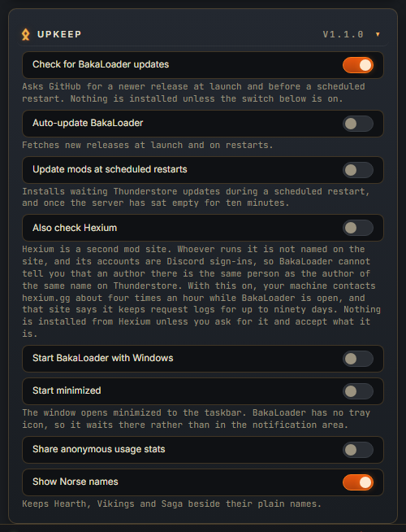
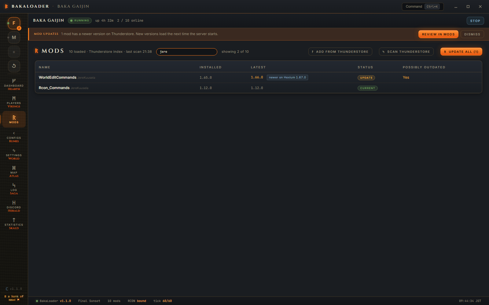

<h1 align="center">Valheim BakaLoader</h1>

  <em>A Windows app that runs your Valheim dedicated server. Start it, keep the mods current, restart on a schedule, see who is online, and look at a map of your actual world.</em> 
  Free, self-hosted on your own PC, no command line. Works with Valheim 1.0.

  
  
  
  
  

  <a href="https://github.com/RyanDMcAfee/ValheimBakaLoader/releases/latest"><b>Download the latest release</b></a>, unzip it anywhere, run <code>ValheimBakaLoader.exe</code>. A short setup wizard runs the first time.

  

> Fan-made. Not affiliated with Iron Gate or Coffee Stain. Use at your own risk, and keep backups of worlds you care about.

**Full documentation is in the [wiki](https://github.com/RyanDMcAfee/ValheimBakaLoader/wiki).** This page is the short version.

---

## What is new in 1.2.0

**A globe in the title bar.** There is a globe just left of the Command chip. Press it and you get every language BakaLoader knows about, each written in its own name, with a line under it saying where it stands: the one you are reading, one already on your machine, one that would cost a download and what it weighs, or one there is no pack for yet. Pick a row and the window is in that language. Nothing reloads: the Log keeps its scrollback, both search boxes keep what you typed, and anything unsaved in the config editor is still unsaved afterwards. English is inside the app; every other language arrives as a pack, downloaded once from the release it belongs to and kept beside your settings rather than in the install folder, so an update or a reinstall cannot take it with it. Every pack is checked against the checksum and the byte count published with it before a word of it is used. Your players are a separate choice: **Messages to players** in Upkeep decides what language the in game restart countdown and the Discord posts are written in, and it offers English without a download because English is built in. Detail: [Languages](https://github.com/RyanDMcAfee/ValheimBakaLoader/wiki/Languages).

**BepInEx, looked after for you.** BepInEx is the loader every mod runs under, and until now BakaLoader said nothing about it at all. There is a row above the mod table now that says whether it is installed, which version you have, and whether BakaLoader is keeping it current. It is the same row on every server, because it is the same BepInEx: servers set up from one install share one copy of it through links on disk, which is also why a write waits until every one of them has stopped. The new switch sits in Upkeep right under **Update mods at scheduled restarts**, and the first time you start a server BakaLoader asks once whether you want it. With it on, a missing loader is put in before the server starts, a newer pack goes in during a scheduled restart, and pasting a mod link with no loader installed fetches BepInEx first and then finishes the install you asked for. An install you made yourself, or Gale or r2modman made, is recognised as such: with the switch off it is left alone and the row's own button is the only thing that moves it, and with the switch on it is taken over at the next restart window, because nothing on disk records which pack it came in so there is no telling whether it is behind. If a server comes up and BepInEx never writes its log, you are told, where that used to be silent. Detail: [BepInEx](https://github.com/RyanDMcAfee/ValheimBakaLoader/wiki/BepInEx).

**A fresh mod index, and a way to ask about one mod.** A host watched a mod put out three releases in an afternoon while BakaLoader reported the old one for hours, and Scan changed nothing. Thunderstore's full listing is a snapshot served from a cache and BakaLoader was holding its own copy of it for fifteen minutes on top. BakaLoader reads Thunderstore's listing index now, where a file that changed is a different address and a stale one cannot be served, with the full listing kept as the fallback. **Scan** asks the site again rather than reading what it was holding, the line under the heading says when the list was actually read rather than when you pressed, and a link with no version on it asks the package's own address for the newest build. **Check this mod now** in the row menu asks about one package directly and says what it found in plain words. A package missing from a list that did come back reads `not listed` rather than `Current`, and offers no update, because a row whose newest version nobody knows is not up to date.

**A world you can name yourself, and a copy of one.** The World box on Settings ends with **New world…**, so naming a world no longer means founding a whole new server in the Forge. Type a name, press Save Config, and the server makes the world the first time it starts. The box says what is wrong with a name while you are still typing it rather than letting the first start fail. Beside it, and on every world's row in the Barrow, a **COPY AS** chip duplicates a world under a name of your own. The copy is a world in its own right from that moment. It is not a plain file copy: a world's name is written down twice, once as the folder and once inside the world's own header, so the name inside the copy is rewritten as well, in both save formats, with everything else left byte for byte where it was, the seed above all. The biome cache comes along under the new name so the copy does not start with the long first boot that builds one, and nothing takes the new name until the whole copy is finished.

**Settings says what it is using, and when it has something to save.** Both **Directories** boxes now carry a line above them beginning `Currently`, naming the path BakaLoader will really use for that server with any `%VARIABLES%` filled in and one word saying where it came from. Both have a Browse button, a placeholder showing the default, and a line underneath saying what is actually at a path you typed. And the form marks its own unsaved work: an ember dot on the field you changed, a notice in the corner opposite Save Config, a breathing button, and a dot on the Settings entry in the rail so you can see it from another hall. Nothing stops you leaving and nothing is saved behind your back.

**The title bar behaves like a title bar.** Double click it to maximize, double click again to put the window back. Drag the title bar of a maximized window and it comes down to its old size under your pointer and keeps following it, which is the one that hurt on an ultra wide monitor. The maximize button now shows which of the two things it is about to do.

**Kill all monsters asks first, with three scopes.** That command really does strike every hostile in every zone the server has loaded, for every player online at that moment. It asks now, and you pick one of three: everywhere, everything hostile inside a radius around one player (100 metres by default), or every one of a single creature you name. The message afterwards is what the server actually said, with its three counts, rather than a cheerful line printed the instant the command left.

**Spawning something for a player no longer costs them their achievements.** Valheim stamps anything its own spawn command conjures as summoned through cheating, and an item carrying that stamp pauses its holder's achievement progress. Both spawn plugins copied that. Nothing BakaLoader spawns is stamped now. If you want it back it is one setting, `MarkSpawnedAsCheated` under `[Spawning]` in each plugin's file in `BepInEx/config`, and BakaLoader now carries that whole section across the rewrite it does at every server start. Anything spawned before this release keeps its stamp, because the flag is written into the item rather than into the setting.

1.1.1 and 1.1.2 were never published on their own and are folded into this release. Full list on the [release notes](https://github.com/RyanDMcAfee/ValheimBakaLoader/wiki/Release-notes).

## What is new in 1.1.0

**A second mod site, off until you turn it on.** Some mods turn up on Hexium before they turn up on Thunderstore, and a few only ever turn up there. A new switch in the Upkeep card, **Also check Hexium**, lets BakaLoader read that site as well. It is off when you install this version and off after an upgrade, and while it is off BakaLoader does not open a connection to hexium.gg at all, not even to open one of its pages in your browser. Turn it on and a mod scan adds one step after the Thunderstore one: a blue mark on the Latest cell of any row where Hexium holds a higher version than both what you have installed and what Thunderstore has, and an **Open on Hexium** entry in the row menu for a mod the site carries.

**The switch carries the whole of what it means, because turning it on is the agreement.** There is no second notice to click through. Whoever runs Hexium is not named on the site, and its accounts are Discord sign-ins, so BakaLoader cannot tell you that an author there is the same person as the author of that name on Thunderstore. With the switch on, your machine contacts hexium.gg about four times an hour while BakaLoader is open, because the index is fetched once and held for fifteen minutes however many mods you have, and the site says it keeps request logs for up to ninety days. With the switch off, nothing in the app names Hexium except the switch itself.

  

**Nothing is ever installed from Hexium on its own.** There is no automatic Hexium update, no Hexium row in **Update all**, and nothing in the scheduled restart or the empty-server restart that reaches for one. The mark is an offer and it waits for you. Choosing to install opens a dialog that names the package, the owner as Hexium spells it, the version, the size of the download when the site gives one, the folder that is already there and will be replaced, and anything the package says it needs, which BakaLoader does not fetch for you. Nothing is downloaded until you press **I accept the risk, install**.

**A mod you took from Hexium is then left alone.** It carries a Hexium chip, it sits out **Update all**, it is not in the waiting updates count, and no scheduled or empty-server restart replaces it. If Thunderstore later moves past it, the row says so and the row menu offers the Thunderstore build, which asks the same way before it replaces anything. Mods you installed by hand are untouched by all of this: BakaLoader only treats a folder as a Hexium install when it put the files there itself and left its own record inside the folder saying so, and it stops believing that record the moment the folder's version stops matching it. A download has to come from an address on hexium.gg before the first request, at every redirect and at the end, it stops at 600 MiB, and if the site listed a size and what arrives is not that size then nothing is installed and the copy you had is left exactly as it was. Detail: [Hexium](https://github.com/RyanDMcAfee/ValheimBakaLoader/wiki/Hexium).

**A search box on the Mods screen.** Type in the box beside the count line and the table narrows as you go. Capitals do not matter and every word has to match somewhere on the row, so `jere world` finds JereKuusela's WorldEditCommands whichever order you type the two words in. It looks at everything the row shows: the mod's name, its author, the folder it sits in, the version numbers and the tags. Escape empties the box, and pressing `/` anywhere on the Mods screen puts the cursor in it, unless you are already typing into something else, where a slash is just a slash. The search narrows what is on screen and nothing else: the loaded count, **Update all**, the sidebar badge and the standing notice about waiting updates all still read every mod, and **Update all** says on hover that it updates every mod with an update, not only the ones shown. The row menu finds a mod by its own name rather than by where it sits in the narrowed table, so every row action acts on the row you clicked. The box empties itself when you switch to another profile.

  

**The Configs screen has a search box too, and the open file has a find box.** The file list narrows the same way, and it matches the mod that wrote a file as well as the file name, so an author's name finds their config even when the file is named after the plugin. In the open file, typing in the find box marks the first match and brings it into view, Enter walks to the next one, Shift and Enter walks back, and the count beside it says which match you are on. The find box never puts the cursor into the config text, never selects any of it and never changes a letter, so nothing you type while you are searching can land in the file. Save still writes the whole file exactly as it stands.

**Configs moved up the sidebar** to sit directly under Mods, so the two screens you move between while fitting a mod out are next to each other. Nothing was renamed and no link changed.

**Names and messages in any alphabet.** BakaLoader and its Commander plugin used to talk to the server in a form with no room for anything but the basic Latin letters, so every other letter turned into a question mark on the way. A player named in Cyrillic, Japanese or Chinese came back into the roster as `???`, and the name BakaLoader then sent back for a spawn, a teleport or a kick was the question marks, which match nobody, so the action failed. Broadcasts and restart warnings written in those alphabets reached the world unreadable. Both ends now speak UTF-8, and a long reply split across packets never cuts a letter in half. Plain English is byte for byte what it always was. The bundled Commander plugin goes from 1.3.0 to 1.3.1 for this, and it is replaced on your next server start like the other bundled plugins.

**Version numbers are compared properly.** A suffix such as `-beta.1` used to be thrown away, so `2.0.13-beta.1` and `2.0.13` looked equal. Versions now compare the way semantic versioning says they should: a pre-release ranks below its own release, `beta.2` comes before `beta.10`, `1.0.666` is higher than `1.0.7`, and a version nothing can read is never treated as newer than the one you have. For nearly every mod this changes nothing. The one case it does change is a mod folder sitting on a suffixed version, where the plain release is now correctly offered as an update.

Full list on the [release notes](https://github.com/RyanDMcAfee/ValheimBakaLoader/wiki/Release-notes).

## What is new in 1.0.9

**Spawning works again after the Valheim update.** The latest Valheim update moved one line inside the game that BakaLoader's spawn plugins were built to read, and they were built before it moved, so the first thing the server did with them was fail. What a host saw was a spawn that half happened: you asked for six meads and one mead appeared, you asked for a two star boar and a plain boar appeared, and nothing in the app said anything was wrong. The server log had the reason in it, a "Field not found" error, once per spawn. Both plugins now ask the running game what that line looks like instead of assuming, so this shape of game change cannot take spawning down again. They are rebuilt against the current game and go into each server the next time it starts, so there is nothing to install by hand. The release also adds a check that reads the shipped plugins against the installed game and refuses a build where one of them names something the game no longer has, which is the check that would have caught this before it reached anybody.

**Item quality arrives, and stackable items arrive as stacks.** The spawn window has always offered a Quality box for tools, weapons and armour, and the number you typed into it was thrown away on the way to the server, so every item turned up at quality one. The quality now goes through, and the item arrives at the full durability for that quality rather than the base one. Modded items that go past quality four keep their own ceiling instead of being cut down to four. Star levels for creatures were never affected by this and behave as before. Stackable items now arrive stacked as well: six meads is one pile of six and 150 wood is three stacks of fifty, where before it was 150 separate pieces on the ground. Anything that does not stack, and every creature, is spawned one at a time exactly as before.

**A spawn the server refused now says so.** The app used to count any reply at all as a success, refusals included. It now reads what the server actually said and puts that line in front of you, so the toast reads `Spawned 6x MeadPoisonResist as 1 stack` or `Spawned 1x PickaxeBronze at quality 3`, and a spawn that did not happen says why in the server's own words instead of the cheerful confirmation that kept this bug out of sight for a whole session.

Full list on the [release notes](https://github.com/RyanDMcAfee/ValheimBakaLoader/wiki/Release-notes).

## What is new in 1.0.8

**Settings you save while the server is up go in at the next restart.** Every automatic restart (the scheduled one, the empty-server one, crash recovery, the one that applies mod updates) and the Restart button used to bring the server back on the settings it was started with. A change saved while the world was up sat on disk doing nothing until somebody pressed Stop and then Start, or closed and reopened the app. World difficulty was the painful one: a new set of modifiers could be ignored for a whole day of restarts. A relaunch now reads the profile again the moment before it launches, so what you saved is what comes back up. If the settings cannot be read for any reason, the relaunch keeps the ones it is already running and says so in the log rather than refusing to restart.

**The app says when the running server is behind what you saved.** A line sits directly above `Save Config` on the Settings screen while the server is up, and saving there now confirms that the running server keeps its current settings until it restarts, instead of a plain "saved" that read as though the change were already in force. A new **Restart pending** row appears on the condition bar when what is on disk differs from what the live server started with. Its action is the same warned restart the dashboard button runs, never a bare stop, and you can wave it away. A later change raises it again, because the row is keyed to the settings themselves.

**A world difficulty that did not get saved no longer passes in silence.** `Save Config` only writes the world dials when the dials on screen belong to the world being saved, which is right. When they do not, it used to skip them quietly under a success toast, so a difficulty you had just set looked saved and was not. It now says which world the dials belong to and asks you to reopen Settings and save again, and the rest of the save still goes through.

Full list on the [release notes](https://github.com/RyanDMcAfee/ValheimBakaLoader/wiki/Release-notes).

## What is new in 1.0.7

**You can see when a newer BakaLoader is ready.** When a newer release is published, the Server card on the dashboard shows a glowing pill naming it, beside the Valheim server's own update pill, and the version at the foot of the sidebar glows the same way and names it too. Clicking either one opens the update dialog.

**The update dialog says what it will do before it does anything.** With every server stopped, **Update and relaunch now** downloads the release, closes BakaLoader, swaps the files and opens the new version, and your profiles, worlds and mods are left alone. While a server is running the only offer is **Update on the next restart**, which installs the new version the next time BakaLoader closes. There is no button anywhere in the dialog that stops your server. **View release notes** opens the GitHub page for that version. BakaLoader also re-checks for a release every six hours while it is open, where before it checked once a day at launch, so a release published while you are hosting turns up the same day.

  

**Safer with more than one window open.** BakaLoader opens a window for each profile set to start with the app, and the "is a server running" check used to look only at the sessions in the window you clicked from. A second window whose own profile was stopped answered that nothing was running while another window had a live world, and the update went ahead on that answer. It now waits until no server anywhere in the app is running, restarting or about to launch, and a Valheim server update in flight counts as well. When an update does run, every window is closed and the app exits fully, so the file swap always starts from a stopped app. The helper that copies the files waits up to two minutes for the app to exit, and if the process is still there it leaves the install alone entirely rather than writing half a version over a running one.

**Condition bar.** The BakaLoader update row now reads differently depending on your two Upkeep switches, and its button is **Update BakaLoader**, which opens the dialog instead of sending you to a browser. A row you dismissed is not raised again every few hours for the same version.

Full list on the [release notes](https://github.com/RyanDMcAfee/ValheimBakaLoader/wiki/Release-notes).

## What is new in 1.0.6

**World modifiers, explained where you set them.** Every dial on the Settings screen now shows a one line explanation of the option you picked, and a **?** marker opens a panel listing every option with what it does and the game settings it applies. The same explanations appear in the "Found a new realm" dialog. Labels say what an option really means: Death penalty **Hard** deletes everything you were not wearing, since only equipped gear reaches your tombstone, and raises skill loss to 1.5 times normal, while **Hardcore** deletes every item and resets all your skills but does not delete your character. "Permadeath" was the wrong word for that and is gone. BakaLoader also clears the world's difficulty keys at every start and writes your settings back, so turning a setting down really turns it down. Before this, moving Death penalty from Hard back to Normal left the key that deletes unequipped items sitting in the world, and players kept losing their inventory on a world whose dial read Normal. Boss and progression keys are left alone, and a difficulty change made with the in-game console no longer survives a restart, so make it in the app. See [World modifiers](https://github.com/RyanDMcAfee/ValheimBakaLoader/wiki/World-modifiers).

**Mods.** Removing a mod now removes its BepInEx patchers folder as well, so a patcher-type mod such as StartupAccelerator actually goes away instead of staying loaded. Patcher mods are listed on the [Mods](https://github.com/RyanDMcAfee/ValheimBakaLoader/wiki/Mods) screen with a "patcher" tag and can be removed there. HookGenPatcher and the BepInEx pack are protected, so they are never listed and never removed. If you run more than one server, the patchers folder is shared between them, so removing a patcher removes it for all of them.

1.0.5 was never released on its own, so it is folded into this one. Full list on the [release notes](https://github.com/RyanDMcAfee/ValheimBakaLoader/wiki/Release-notes).

## What is new in 1.0.3

**Mods screen.** Updating all mods now shows a progress bar and a per-mod status instead of one spinner, and you can right-click a single mod to update just it. A new "Possibly outdated" column flags a mod when its newest Thunderstore version came out before Valheim was last updated, as a hint, not proof. Removing a mod now lists the installed mods that depend on it and offers to remove them too, off by default. Full list on the [release notes](https://github.com/RyanDMcAfee/ValheimBakaLoader/wiki/Release-notes).

## What is new in 1.0.2

Update checking is now its own switch, separate from installing, and it runs before a scheduled restart as well as at launch. One switch drives both automatic mod update paths. The window can start minimized. A switch under the password box holds you to Valheim's own password rule instead of letting the game turn the start down. Worlds can be deleted from the app, with a typed confirmation and the backups kept unless you say otherwise. Statistics can be reset, with the old journal set aside rather than thrown away. Full list in the [release notes](https://github.com/RyanDMcAfee/ValheimBakaLoader/wiki/Release-notes).

## What is new in 1.0.1

**Update the Valheim server from the app.** When Steam has a server update queued, the start prompt offers **Update and start**: BakaLoader copies your worlds aside, runs the update, then starts the server. A server installed through your Steam library is updated by Steam itself, which BakaLoader then watches until the download is whole. A standalone install is updated with steamcmd, which BakaLoader downloads once and asks Windows to verify Valve's signature on. A failed update keeps the server stopped and tells you why. While it runs, every way of starting the server is refused, and closing BakaLoader waits until it is done, so nothing ever starts out of a folder that is halfway through being replaced.

  

**Live player positions** in the roster while the server runs with RCON on, refreshed every few seconds and never stale.

**The Ashlands is drawn properly.** The map now uses the game's final terrain formula, with the game's own noise functions, instead of the pregeneration approximation. Coastlines match the world you play in.

**Backups without a world.** Layers left behind by a world that is gone were on disk but nowhere on screen. The backup manager now lists them, so you can bring the world back or take the space.

**Fixes** across the launch guard, backups and the interface: an unreadable Steam manifest no longer clears the guard, a backup that copied nothing now stops the start, a damaged backup layer is shown rather than hidden, row actions that need a player online are greyed out with the reason instead of failing when you press them, and the mod row menu gained a link to each mod's Thunderstore page.

Everything else is on the [release notes](https://github.com/RyanDMcAfee/ValheimBakaLoader/wiki/Release-notes).

---

## Valheim 1.0

Valheim 1.0 shipped on 9 September 2026 and changed a few things that server tools have to keep up with. BakaLoader handles them.

Worlds are folders now, and converting an old world is one way. A 1.0 server rewrites an older world on its first save and keeps the old files as a backup, and an older server cannot read the result. BakaLoader lists and backs up both formats side by side, and warns before that first save. See [World file formats](https://github.com/RyanDMcAfee/ValheimBakaLoader/wiki/World-file-formats).

Starting on a build you have not run before now asks first, and offers to back up every world. Automatic starts and restarts wait for you instead of running unattended. See [Server updates and the launch guard](https://github.com/RyanDMcAfee/ValheimBakaLoader/wiki/Server-updates-and-the-launch-guard).

Admin, ban and allow lists changed format. 1.0 only matches Steam ids written as `V_<steamid>`, and old files with bare ids look like everyone being banned. BakaLoader writes both forms and upgrades your existing lists.

PlayStation and Nintendo Switch players show up in the roster like everyone else, and the map generator follows the 1.0 terrain.

If you run mods, expect some of them to need updates from their authors. BakaLoader shows what is current on Thunderstore.

---

## What it does

The app is split into nine screens. Each has a plain name, with its Norse name shown underneath as a small caption. A "Show Norse names" switch hides the captions if you want plain labels only. A header on every screen shows the active server, its state, uptime and players online, with one Start or Stop button. The globe in the title bar puts the whole window in another language.

| Screen | What it is for |
|---|---|
| [**Dashboard**](https://github.com/RyanDMcAfee/ValheimBakaLoader/wiki/Dashboard-%28Hearth%29) (Hearth) | Server status, who is online, next save, network addresses, CPU and RAM, a tail of the log, and the app's own settings. |
| [**Players**](https://github.com/RyanDMcAfee/ValheimBakaLoader/wiki/Players-%28Vikings%29) (Vikings) | A sortable table with platform, session time, total playtime, last seen, deaths and position. Right-click for promote, allow, kick, ban, heal, teleport or spawn items nearby. A spawn arrives at the quality you asked for, stacked where the item stacks, unmarked by the game's cheat stamp, and the server's own reply comes back to you. |
| [**Mods**](https://github.com/RyanDMcAfee/ValheimBakaLoader/wiki/Mods) | Scans your BepInEx folder against Thunderstore's freshest index, with a search box over the table. Update one, update all, ask about one mod directly, or paste a link to install. A row above the table installs and keeps [BepInEx](https://github.com/RyanDMcAfee/ValheimBakaLoader/wiki/BepInEx) itself. Hexium can be read as a second source once you switch it on, and nothing is installed or updated from it unless you ask for it. |
| [**Settings**](https://github.com/RyanDMcAfee/ValheimBakaLoader/wiki/Settings-%28World%29) (World) | Server name, password, port, world and seed, crossplay, backups, world modifiers with every option explained beside the dial, restart rules, RCON and folders. Name a new world or copy an existing one from the World box, and the form marks what it has not saved yet. |
| [**Map**](https://github.com/RyanDMcAfee/ValheimBakaLoader/wiki/Map-%28Atlas%29) (Atlas) | Your world drawn from its seed with no map mods, fog of war from what players have shared at cartography tables, portals and builds as layers, and a weather forecast. |
| [**Configs**](https://github.com/RyanDMcAfee/ValheimBakaLoader/wiki/Configs-%28Runes%29) (Runes) | Edit your mods' config files in the app. The list has a search box over it, and the open file has a find box that never touches the text. |
| [**Log**](https://github.com/RyanDMcAfee/ValheimBakaLoader/wiki/Log-%28Saga%29) (Saga) | The live server log with levels, search, pause on scroll, and a console line. |
| [**Discord**](https://github.com/RyanDMcAfee/ValheimBakaLoader/wiki/Discord-%28Herald%29) (Herald) | One status post in a Discord channel that edits itself as the server changes. |
| [**Statistics**](https://github.com/RyanDMcAfee/ValheimBakaLoader/wiki/Statistics-%28Skald%29) (Skald) | Uptime, sessions, deaths and mod history, counted on your machine only. |

### Running the server

Start, stop and restart from the app. Scheduled restarts warn players in game first. Optional restart when the last player leaves, and relaunch after a crash. A restart reads the profile again first, so a setting you saved while the world was up is what the server comes back on.

The server process is tied to the app, so it cannot linger after BakaLoader closes, even through Task Manager or a crash. If a matching server is already running when you open BakaLoader, it offers to adopt it. Closing the app while players are online asks first, then saves the world on the way out.

Copy your public address, LAN address or crossplay join code from the dashboard, or give the server a name of its own with the domain wizard. Minimize to the tray if you want it out of the way.

Conditions that stay true, such as a server update waiting, a held start, a failed backup, a crash with a relaunch pending, a newer BakaLoader waiting to install, or saved settings the running server has not picked up yet, sit in a bar above the page with their action until you deal with them. Toasts are only used to confirm what you just did.

Detail: [Running the server](https://github.com/RyanDMcAfee/ValheimBakaLoader/wiki/Running-the-server).

### More than one server

Each server has its own profile. Profiles can be fully isolated with their own install, mods and save folder. Switching is one click in the sidebar. The new-server wizard picks a free port and warns about collisions before they happen. Orphaned worlds from an old setup can be adopted by copying them, and your originals stay where they are.

Detail: [Multiple servers](https://github.com/RyanDMcAfee/ValheimBakaLoader/wiki/Multiple-servers).

### Backups

The World saves card and the backup manager list every backup layer for every world: the game's automatic snapshots, the copies BakaLoader takes before a restore or an update, and the pre-1.0 originals the game keeps after converting a world. Restore any layer with one click, and the live world is copied aside first so the restore is itself undoable. Nothing is deleted without asking.

Detail: [Worlds, backups and restore](https://github.com/RyanDMcAfee/ValheimBakaLoader/wiki/Worlds-backups-and-restore).

### Updating BakaLoader

BakaLoader asks GitHub for a newer release at launch and every six hours while it is open. When one turns up, the dashboard and the sidebar say so, and a dialog explains what installing it would do before anything happens. With every server stopped you can take it there and then: the app closes, swaps its own files and opens again on the new version, with your profiles, worlds and mods untouched. With a world up, the only offer is to set it for the next restart, because installing means closing the app, and that would take your server down with it. Nothing installs itself while a server is running in any window.

Both switches, checking and installing, are in the Upkeep card on the dashboard. Detail: [Updating BakaLoader](https://github.com/RyanDMcAfee/ValheimBakaLoader/wiki/Updating-BakaLoader).

---

## Quick start

1. Download the latest release, unzip it, run `ValheimBakaLoader.exe`. The wizard finds your Valheim Dedicated Server install and your worlds.
2. On the Settings screen give the server a name and a password. The default port is fine for most people.
3. Pick an existing world, or type a new name and choose a seed.
4. Choose how people join. Public lists it in the in-game browser. Crossplay lets anyone on any platform join with a code.
5. Press Start. When the status says Running, press **Copy join info** and send it to your friends.

Friends outside your network usually need UDP 2456 and 2457 forwarded on your router and allowed through Windows Firewall, unless you use crossplay. The wizard shows which ports, and the [Privacy and network](https://github.com/RyanDMcAfee/ValheimBakaLoader/wiki/Privacy-and-network) page walks through both.

In-game broadcasts, the restart countdown and the player actions use RCON through a small server-side plugin that BakaLoader installs when you first need it. Everything else works without any plugin.

Longer version: [Install and first run](https://github.com/RyanDMcAfee/ValheimBakaLoader/wiki/Install-and-first-run).

---

## A look inside

<table width="100%">
  <tr>
    <td width="50%" valign="top">
      
      
<strong>Map.</strong> The world drawn from the seed, with fog of war and a forecast.

    </td>
    <td width="50%" valign="top">
      
      
<strong>Players.</strong> Who is on, from where, for how long, where they are standing, and a menu for the rest.

    </td>
  </tr>
  <tr>
    <td width="50%" valign="top">
      
      
<strong>Mods.</strong> Thunderstore scan, a search box, one-click updates, paste a link to install.

    </td>
    <td width="50%" valign="top">
      
      
<strong>Settings.</strong> Everything the server is started with, in one form.

    </td>
  </tr>
  <tr>
    <td width="50%" valign="top">
      
      
<strong>Log.</strong> The live log with the noise filtered out and a console line.

    </td>
    <td width="50%" valign="top">
      
      
<strong>Command palette.</strong> <kbd>Ctrl</kbd>+<kbd>K</kbd> anywhere: restart, kick, broadcast, save.

    </td>
  </tr>
</table>

---

## Requirements

- Windows 10 or 11, 64-bit.
- [.NET 6 Desktop Runtime](https://dotnet.microsoft.com/download/dotnet/6.0). Windows prompts you on first run if it is missing.
- Valheim Dedicated Server, free in your Steam library under Tools. The wizard can point at any install, including one managed by SteamCMD.

No Linux build and no Docker image. BakaLoader is a Windows app built around the Windows server binary.

---

## Security and privacy

This is a program that starts a server process, edits files in your Valheim folders, and talks to a few services. Here is the short list, and [Privacy and network](https://github.com/RyanDMcAfee/ValheimBakaLoader/wiki/Privacy-and-network) has the long one.

**Network connections it makes**

- `thunderstore.io` to read the mod index, to ask about one package when you press "Check this mod now" or paste a link with no version on it, and to download mod files you asked for. The same host serves BepInEx, which BakaLoader fetches when you press Install or, with "BepInEx kept up to date by BakaLoader" on, when a scheduled restart finds a newer pack.
- `hexium.gg` to read its mod index and to download a mod you asked for there, and only while "Also check Hexium" is on in Upkeep. That switch is off unless you turn it on, and while it is off BakaLoader does not open a connection to that site at all. With it on, the index is read about four times an hour while the app is open, and the site says it keeps request logs for up to ninety days.
- `api.github.com` and GitHub release downloads to check for and fetch BakaLoader updates.
- The same two GitHub addresses for language packs. Opening the globe or the Upkeep card reads the release for the version you are running and downloads the small list of published packs, and pressing a language downloads that pack. Those are requests you made, so they happen whatever the update switch is set to. The one request BakaLoader makes here on its own account is fetching a pack for a new version after it has updated itself, while you are reading a language other than English, and "Check for BakaLoader updates" is the switch that stops that one. A window that has never been near the globe asks for nothing and downloads nothing.
- `api.ipify.org` to find your public address for the join info.
- Valve's own address for steamcmd, once, and the Steam client for a server update.
- Your own Discord webhook, only if you set one up on the Discord screen.
- An anonymous heartbeat to a small stats endpoint, about every 5 minutes while the app is open: a one-way hashed device id, the app version, and whether a server is running. No addresses, names, passwords, world data or player data. Turn it off in Upkeep with "Share anonymous usage stats".

**Files it writes**

- Its own settings, statistics and logs under `%USERPROFILE%\AppData\LocalLow\BakaLoader\ValheimBakaLoader\`, and the language packs you downloaded, in a `languages` folder beside them so an update or a reinstall cannot take them with it.
- Your server's BepInEx folders when you install, update or remove mods, and the admin, ban and allow lists when you use the player actions. BepInEx itself when you install or update it from the row above the mod table, or at a scheduled restart with the Upkeep switch on: four loose files beside the server executable, the whole of `BepInEx\core`, and the pack's `BepInEx.cfg` only when there is not one already. Your plugins, patchers and mod configs are not touched, and the core being replaced is copied aside first. A mod BakaLoader installed from Hexium also gets a small record inside its own folder saying where it came from, which is how the app knows to leave that folder out of its updates.
- Backups and restores inside your Valheim save folder, always as copies, never in place.

Your server password and RCON password are stored in plain text in `userprefs.json`.

The source is in this repository and every release is built from it. If Windows SmartScreen warns you on first run, that is because the release is not code-signed. Check the download against the release page and decide.

---

## When something goes wrong

Start with the [Troubleshooting](https://github.com/RyanDMcAfee/ValheimBakaLoader/wiki/Troubleshooting) page, which covers the usual ones: the server will not start after a game update, players seeing "incompatible version", everyone refused as banned since 1.0, a mod that will not show up, and a map that will not draw. The [FAQ](https://github.com/RyanDMcAfee/ValheimBakaLoader/wiki/FAQ) has the short answers.

Logs are in `%USERPROFILE%\AppData\LocalLow\BakaLoader\ValheimBakaLoader\logs\`. Application logs are per day, server logs are per session, and you can change the folder on the Log screen.

If none of that covers it, open an issue with the log lines around the problem, or post in [Discussions](https://github.com/RyanDMcAfee/ValheimBakaLoader/discussions).

## Mod authors

If you want your mod's items in the spawn picker or its config handled better, open an issue with the Thunderstore link. [For mod authors](https://github.com/RyanDMcAfee/ValheimBakaLoader/wiki/For-mod-authors) says exactly what BakaLoader needs from a mod, how items are named and classified, and which command names and Harmony targets the bundled plugins already use. BakaLoader is a solo project and does not take code contributions.

## License

Free to download and use under the BakaLoader Source-Available License: run it for any server, personal or community, and read the source. Redistribution and derivative works are not permitted. See [LICENSE](LICENSE).

Valheim is a trademark of Iron Gate AB. This is an independent, unofficial tool.
