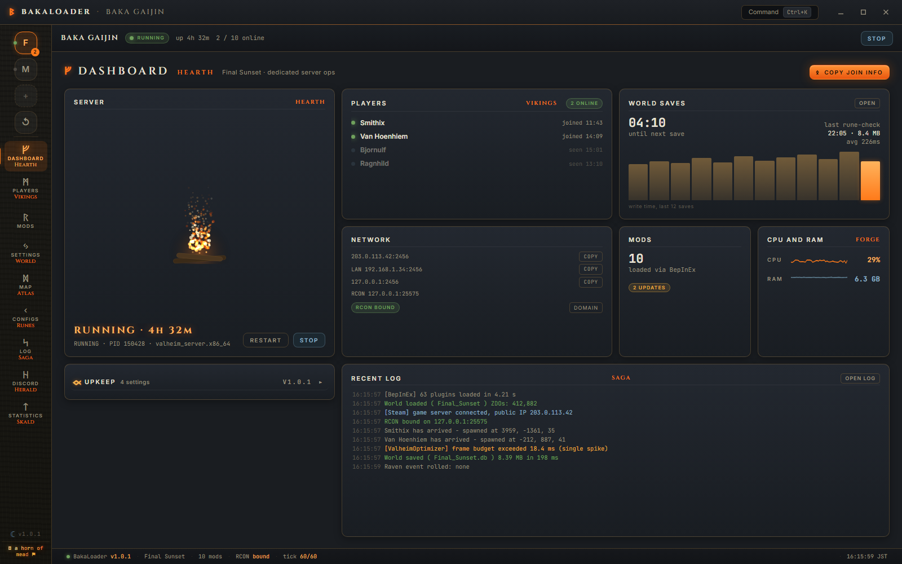
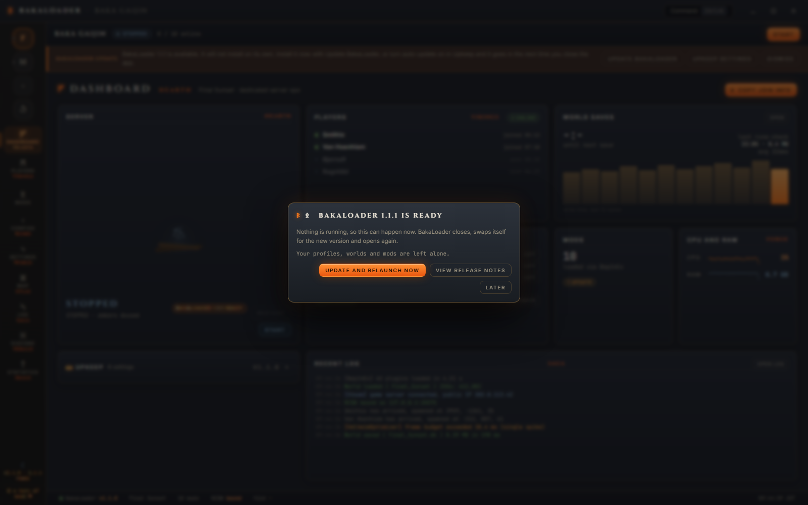
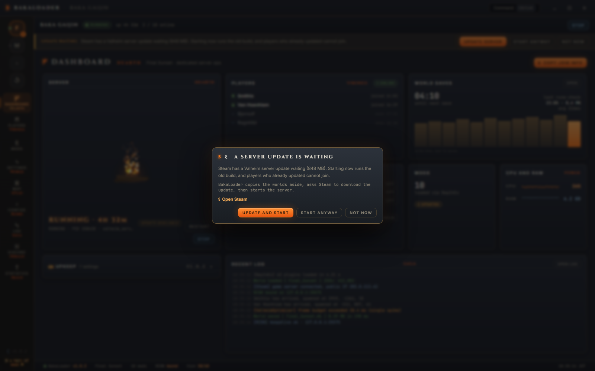
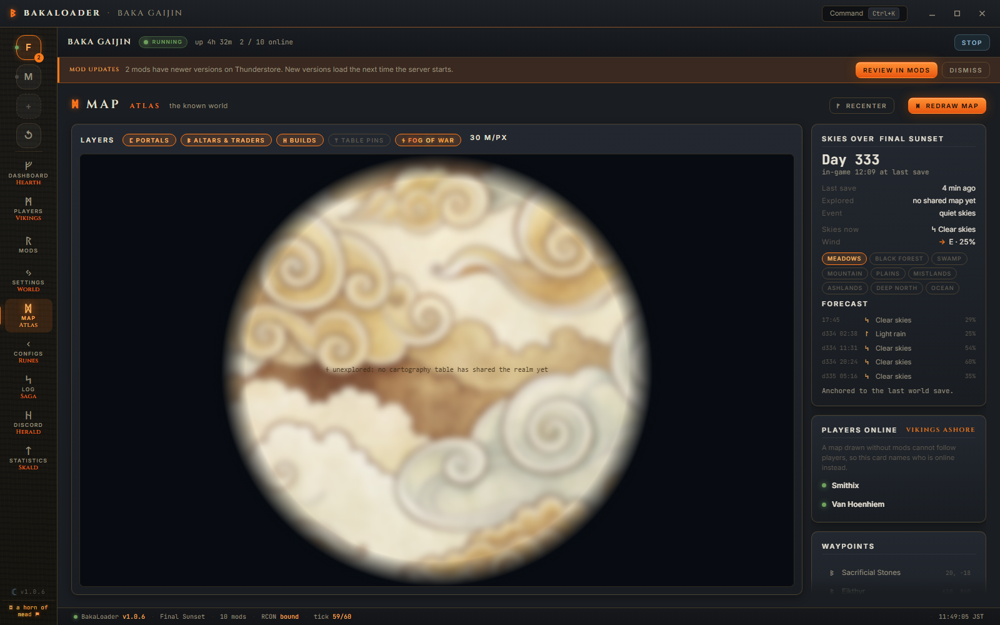
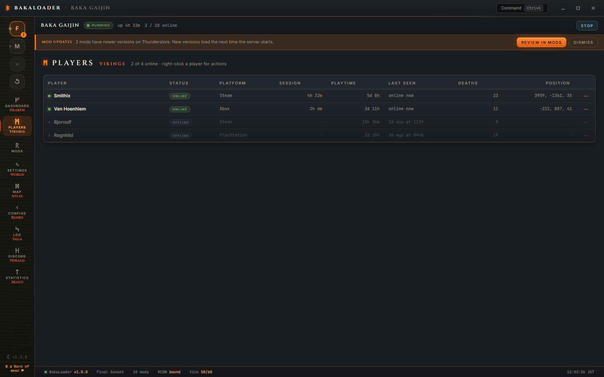
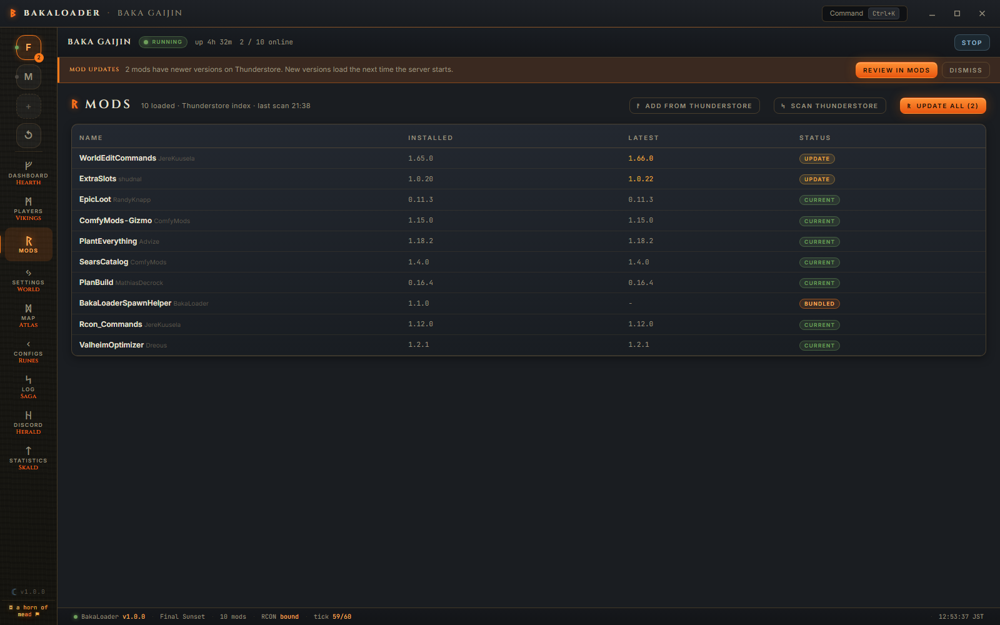
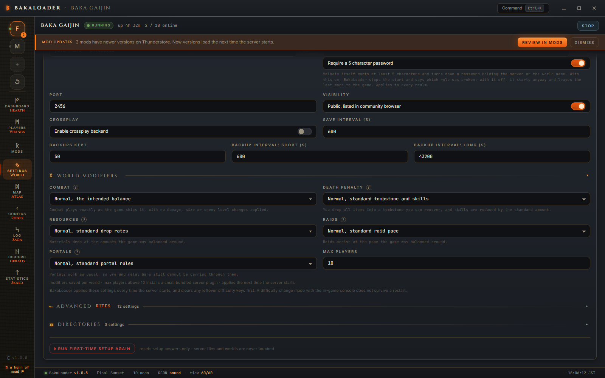
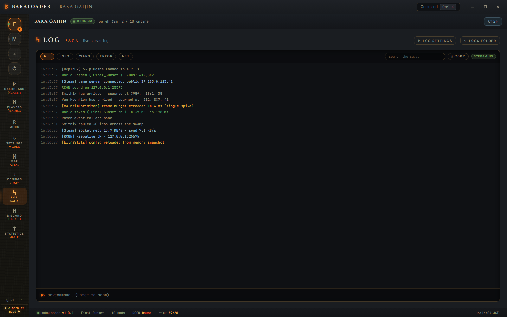
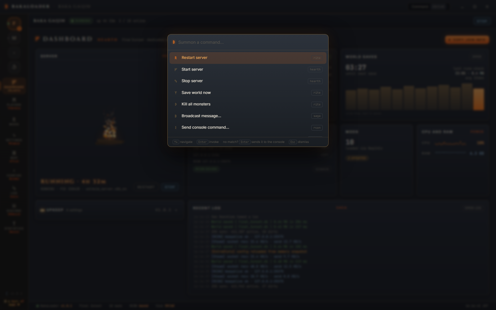

<h1 align="center">Valheim BakaLoader</h1>

  <em>A Windows app that runs your Valheim dedicated server. Start it, keep the mods current, restart on a schedule, see who is online, and look at a map of your actual world.</em> 
  Free, self-hosted on your own PC, no command line. Works with Valheim 1.0.

  
  
  
  
  

  <a href="https://github.com/RyanDMcAfee/ValheimBakaLoader/releases/latest"><b>Download the latest release</b></a>, unzip it anywhere, run <code>ValheimBakaLoader.exe</code>. A short setup wizard runs the first time.

  

> Fan-made. Not affiliated with Iron Gate or Coffee Stain. Use at your own risk, and keep backups of worlds you care about.

**Full documentation is in the [wiki](https://github.com/RyanDMcAfee/ValheimBakaLoader/wiki).** This page is the short version.

---

## What is new in 1.0.8

**Settings you save while the server is up go in at the next restart.** Every automatic restart (the scheduled one, the empty-server one, crash recovery, the one that applies mod updates) and the Restart button used to bring the server back on the settings it was started with. A change saved while the world was up sat on disk doing nothing until somebody pressed Stop and then Start, or closed and reopened the app. World difficulty was the painful one: a new set of modifiers could be ignored for a whole day of restarts. A relaunch now reads the profile again the moment before it launches, so what you saved is what comes back up. If the settings cannot be read for any reason, the relaunch keeps the ones it is already running and says so in the log rather than refusing to restart.

**The app says when the running server is behind what you saved.** A line sits directly above `Save Config` on the Settings screen while the server is up, and saving there now confirms that the running server keeps its current settings until it restarts, instead of a plain "saved" that read as though the change were already in force. A new **Restart pending** row appears on the condition bar when what is on disk differs from what the live server started with. Its action is the same warned restart the dashboard button runs, never a bare stop, and you can wave it away. A later change raises it again, because the row is keyed to the settings themselves.

**A world difficulty that did not get saved no longer passes in silence.** `Save Config` only writes the world dials when the dials on screen belong to the world being saved, which is right. When they do not, it used to skip them quietly under a success toast, so a difficulty you had just set looked saved and was not. It now says which world the dials belong to and asks you to reopen Settings and save again, and the rest of the save still goes through.

Full list on the [release notes](https://github.com/RyanDMcAfee/ValheimBakaLoader/wiki/Release-notes).

## What is new in 1.0.7

**You can see when a newer BakaLoader is ready.** When a newer release is published, the Server card on the dashboard shows a glowing pill naming it, beside the Valheim server's own update pill, and the version at the foot of the sidebar glows the same way and names it too. Clicking either one opens the update dialog.

**The update dialog says what it will do before it does anything.** With every server stopped, **Update and relaunch now** downloads the release, closes BakaLoader, swaps the files and opens the new version, and your profiles, worlds and mods are left alone. While a server is running the only offer is **Update on the next restart**, which installs the new version the next time BakaLoader closes. There is no button anywhere in the dialog that stops your server. **View release notes** opens the GitHub page for that version. BakaLoader also re-checks for a release every six hours while it is open, where before it checked once a day at launch, so a release published while you are hosting turns up the same day.

  

**Safer with more than one window open.** BakaLoader opens a window for each profile set to start with the app, and the "is a server running" check used to look only at the sessions in the window you clicked from. A second window whose own profile was stopped answered that nothing was running while another window had a live world, and the update went ahead on that answer. It now waits until no server anywhere in the app is running, restarting or about to launch, and a Valheim server update in flight counts as well. When an update does run, every window is closed and the app exits fully, so the file swap always starts from a stopped app. The helper that copies the files waits up to two minutes for the app to exit, and if the process is still there it leaves the install alone entirely rather than writing half a version over a running one.

**Condition bar.** The BakaLoader update row now reads differently depending on your two Upkeep switches, and its button is **Update BakaLoader**, which opens the dialog instead of sending you to a browser. A row you dismissed is not raised again every few hours for the same version.

Full list on the [release notes](https://github.com/RyanDMcAfee/ValheimBakaLoader/wiki/Release-notes).

## What is new in 1.0.6

**World modifiers, explained where you set them.** Every dial on the Settings screen now shows a one line explanation of the option you picked, and a **?** marker opens a panel listing every option with what it does and the game settings it applies. The same explanations appear in the "Found a new realm" dialog. Labels say what an option really means: Death penalty **Hard** deletes everything you were not wearing, since only equipped gear reaches your tombstone, and raises skill loss to 1.5 times normal, while **Hardcore** deletes every item and resets all your skills but does not delete your character. "Permadeath" was the wrong word for that and is gone. BakaLoader also clears the world's difficulty keys at every start and writes your settings back, so turning a setting down really turns it down. Before this, moving Death penalty from Hard back to Normal left the key that deletes unequipped items sitting in the world, and players kept losing their inventory on a world whose dial read Normal. Boss and progression keys are left alone, and a difficulty change made with the in-game console no longer survives a restart, so make it in the app. See [World modifiers](https://github.com/RyanDMcAfee/ValheimBakaLoader/wiki/World-modifiers).

**Mods.** Removing a mod now removes its BepInEx patchers folder as well, so a patcher-type mod such as StartupAccelerator actually goes away instead of staying loaded. Patcher mods are listed on the [Mods](https://github.com/RyanDMcAfee/ValheimBakaLoader/wiki/Mods) screen with a "patcher" tag and can be removed there. HookGenPatcher and the BepInEx pack are protected, so they are never listed and never removed. If you run more than one server, the patchers folder is shared between them, so removing a patcher removes it for all of them.

1.0.5 was never released on its own, so it is folded into this one. Full list on the [release notes](https://github.com/RyanDMcAfee/ValheimBakaLoader/wiki/Release-notes).

## What is new in 1.0.3

**Mods screen.** Updating all mods now shows a progress bar and a per-mod status instead of one spinner, and you can right-click a single mod to update just it. A new "Possibly outdated" column flags a mod when its newest Thunderstore version came out before Valheim was last updated, as a hint, not proof. Removing a mod now lists the installed mods that depend on it and offers to remove them too, off by default. Full list on the [release notes](https://github.com/RyanDMcAfee/ValheimBakaLoader/wiki/Release-notes).

## What is new in 1.0.2

Update checking is now its own switch, separate from installing, and it runs before a scheduled restart as well as at launch. One switch drives both automatic mod update paths. The window can start minimized. A switch under the password box holds you to Valheim's own password rule instead of letting the game turn the start down. Worlds can be deleted from the app, with a typed confirmation and the backups kept unless you say otherwise. Statistics can be reset, with the old journal set aside rather than thrown away. Full list in the [release notes](https://github.com/RyanDMcAfee/ValheimBakaLoader/wiki/Release-notes).

## What is new in 1.0.1

**Update the Valheim server from the app.** When Steam has a server update queued, the start prompt offers **Update and start**: BakaLoader copies your worlds aside, runs the update, then starts the server. A server installed through your Steam library is updated by Steam itself, which BakaLoader then watches until the download is whole. A standalone install is updated with steamcmd, which BakaLoader downloads once and asks Windows to verify Valve's signature on. A failed update keeps the server stopped and tells you why. While it runs, every way of starting the server is refused, and closing BakaLoader waits until it is done, so nothing ever starts out of a folder that is halfway through being replaced.

  

**Live player positions** in the roster while the server runs with RCON on, refreshed every few seconds and never stale.

**The Ashlands is drawn properly.** The map now uses the game's final terrain formula, with the game's own noise functions, instead of the pregeneration approximation. Coastlines match the world you play in.

**Backups without a world.** Layers left behind by a world that is gone were on disk but nowhere on screen. The backup manager now lists them, so you can bring the world back or take the space.

**Fixes** across the launch guard, backups and the interface: an unreadable Steam manifest no longer clears the guard, a backup that copied nothing now stops the start, a damaged backup layer is shown rather than hidden, row actions that need a player online are greyed out with the reason instead of failing when you press them, and the mod row menu gained a link to each mod's Thunderstore page.

Everything else is on the [release notes](https://github.com/RyanDMcAfee/ValheimBakaLoader/wiki/Release-notes).

---

## Valheim 1.0

Valheim 1.0 shipped on 9 September 2026 and changed a few things that server tools have to keep up with. BakaLoader handles them.

Worlds are folders now, and converting an old world is one way. A 1.0 server rewrites an older world on its first save and keeps the old files as a backup, and an older server cannot read the result. BakaLoader lists and backs up both formats side by side, and warns before that first save. See [World file formats](https://github.com/RyanDMcAfee/ValheimBakaLoader/wiki/World-file-formats).

Starting on a build you have not run before now asks first, and offers to back up every world. Automatic starts and restarts wait for you instead of running unattended. See [Server updates and the launch guard](https://github.com/RyanDMcAfee/ValheimBakaLoader/wiki/Server-updates-and-the-launch-guard).

Admin, ban and allow lists changed format. 1.0 only matches Steam ids written as `V_<steamid>`, and old files with bare ids look like everyone being banned. BakaLoader writes both forms and upgrades your existing lists.

PlayStation and Nintendo Switch players show up in the roster like everyone else, and the map generator follows the 1.0 terrain.

If you run mods, expect some of them to need updates from their authors. BakaLoader shows what is current on Thunderstore.

---

## What it does

The app is split into nine screens. Each has a plain name, with its Norse name shown underneath as a small caption. A "Show Norse names" switch hides the captions if you want plain labels only. A header on every screen shows the active server, its state, uptime and players online, with one Start or Stop button.

| Screen | What it is for |
|---|---|
| [**Dashboard**](https://github.com/RyanDMcAfee/ValheimBakaLoader/wiki/Dashboard-%28Hearth%29) (Hearth) | Server status, who is online, next save, network addresses, CPU and RAM, a tail of the log, and the app's own settings. |
| [**Players**](https://github.com/RyanDMcAfee/ValheimBakaLoader/wiki/Players-%28Vikings%29) (Vikings) | A sortable table with platform, session time, total playtime, last seen, deaths and position. Right-click for promote, allow, kick, ban, heal, teleport or spawn items nearby. |
| [**Mods**](https://github.com/RyanDMcAfee/ValheimBakaLoader/wiki/Mods) | Scans your BepInEx folder against Thunderstore. Update one, update all, or paste a Thunderstore link to install. |
| [**Settings**](https://github.com/RyanDMcAfee/ValheimBakaLoader/wiki/Settings-%28World%29) (World) | Server name, password, port, world and seed, crossplay, backups, world modifiers with every option explained beside the dial, restart rules, RCON and folders. |
| [**Map**](https://github.com/RyanDMcAfee/ValheimBakaLoader/wiki/Map-%28Atlas%29) (Atlas) | Your world drawn from its seed with no map mods, fog of war from what players have shared at cartography tables, portals and builds as layers, and a weather forecast. |
| [**Configs**](https://github.com/RyanDMcAfee/ValheimBakaLoader/wiki/Configs-%28Runes%29) (Runes) | Edit your mods' config files in the app. |
| [**Log**](https://github.com/RyanDMcAfee/ValheimBakaLoader/wiki/Log-%28Saga%29) (Saga) | The live server log with levels, search, pause on scroll, and a console line. |
| [**Discord**](https://github.com/RyanDMcAfee/ValheimBakaLoader/wiki/Discord-%28Herald%29) (Herald) | One status post in a Discord channel that edits itself as the server changes. |
| [**Statistics**](https://github.com/RyanDMcAfee/ValheimBakaLoader/wiki/Statistics-%28Skald%29) (Skald) | Uptime, sessions, deaths and mod history, counted on your machine only. |

### Running the server

Start, stop and restart from the app. Scheduled restarts warn players in game first. Optional restart when the last player leaves, and relaunch after a crash. A restart reads the profile again first, so a setting you saved while the world was up is what the server comes back on.

The server process is tied to the app, so it cannot linger after BakaLoader closes, even through Task Manager or a crash. If a matching server is already running when you open BakaLoader, it offers to adopt it. Closing the app while players are online asks first, then saves the world on the way out.

Copy your public address, LAN address or crossplay join code from the dashboard, or give the server a name of its own with the domain wizard. Minimize to the tray if you want it out of the way.

Conditions that stay true, such as a server update waiting, a held start, a failed backup, a crash with a relaunch pending, a newer BakaLoader waiting to install, or saved settings the running server has not picked up yet, sit in a bar above the page with their action until you deal with them. Toasts are only used to confirm what you just did.

Detail: [Running the server](https://github.com/RyanDMcAfee/ValheimBakaLoader/wiki/Running-the-server).

### More than one server

Each server has its own profile. Profiles can be fully isolated with their own install, mods and save folder. Switching is one click in the sidebar. The new-server wizard picks a free port and warns about collisions before they happen. Orphaned worlds from an old setup can be adopted by copying them, and your originals stay where they are.

Detail: [Multiple servers](https://github.com/RyanDMcAfee/ValheimBakaLoader/wiki/Multiple-servers).

### Backups

The World saves card and the backup manager list every backup layer for every world: the game's automatic snapshots, the copies BakaLoader takes before a restore or an update, and the pre-1.0 originals the game keeps after converting a world. Restore any layer with one click, and the live world is copied aside first so the restore is itself undoable. Nothing is deleted without asking.

Detail: [Worlds, backups and restore](https://github.com/RyanDMcAfee/ValheimBakaLoader/wiki/Worlds-backups-and-restore).

### Updating BakaLoader

BakaLoader asks GitHub for a newer release at launch and every six hours while it is open. When one turns up, the dashboard and the sidebar say so, and a dialog explains what installing it would do before anything happens. With every server stopped you can take it there and then: the app closes, swaps its own files and opens again on the new version, with your profiles, worlds and mods untouched. With a world up, the only offer is to set it for the next restart, because installing means closing the app, and that would take your server down with it. Nothing installs itself while a server is running in any window.

Both switches, checking and installing, are in the Upkeep card on the dashboard. Detail: [Install and first run](https://github.com/RyanDMcAfee/ValheimBakaLoader/wiki/Install-and-first-run).

---

## Quick start

1. Download the latest release, unzip it, run `ValheimBakaLoader.exe`. The wizard finds your Valheim Dedicated Server install and your worlds.
2. On the Settings screen give the server a name and a password. The default port is fine for most people.
3. Pick an existing world, or type a new name and choose a seed.
4. Choose how people join. Public lists it in the in-game browser. Crossplay lets anyone on any platform join with a code.
5. Press Start. When the status says Running, press **Copy join info** and send it to your friends.

Friends outside your network usually need UDP 2456 and 2457 forwarded on your router and allowed through Windows Firewall, unless you use crossplay. The wizard shows which ports, and the [Privacy and network](https://github.com/RyanDMcAfee/ValheimBakaLoader/wiki/Privacy-and-network) page walks through both.

In-game broadcasts, the restart countdown and the player actions use RCON through a small server-side plugin that BakaLoader installs when you first need it. Everything else works without any plugin.

Longer version: [Install and first run](https://github.com/RyanDMcAfee/ValheimBakaLoader/wiki/Install-and-first-run).

---

## A look inside

<table width="100%">
  <tr>
    <td width="50%" valign="top">
      
      
<strong>Map.</strong> The world drawn from the seed, with fog of war and a forecast.

    </td>
    <td width="50%" valign="top">
      
      
<strong>Players.</strong> Who is on, from where, for how long, where they are standing, and a menu for the rest.

    </td>
  </tr>
  <tr>
    <td width="50%" valign="top">
      
      
<strong>Mods.</strong> Thunderstore scan, one-click updates, paste a link to install.

    </td>
    <td width="50%" valign="top">
      
      
<strong>Settings.</strong> Everything the server is started with, in one form.

    </td>
  </tr>
  <tr>
    <td width="50%" valign="top">
      
      
<strong>Log.</strong> The live log with the noise filtered out and a console line.

    </td>
    <td width="50%" valign="top">
      
      
<strong>Command palette.</strong> <kbd>Ctrl</kbd>+<kbd>K</kbd> anywhere: restart, kick, broadcast, save.

    </td>
  </tr>
</table>

---

## Requirements

- Windows 10 or 11, 64-bit.
- [.NET 6 Desktop Runtime](https://dotnet.microsoft.com/download/dotnet/6.0). Windows prompts you on first run if it is missing.
- Valheim Dedicated Server, free in your Steam library under Tools. The wizard can point at any install, including one managed by SteamCMD.

No Linux build and no Docker image. BakaLoader is a Windows app built around the Windows server binary.

---

## Security and privacy

This is a program that starts a server process, edits files in your Valheim folders, and talks to a few services. Here is the short list, and [Privacy and network](https://github.com/RyanDMcAfee/ValheimBakaLoader/wiki/Privacy-and-network) has the long one.

**Network connections it makes**

- `thunderstore.io` to read the mod index and download mod files you asked for.
- `api.github.com` and GitHub release downloads to check for and fetch BakaLoader updates.
- `api.ipify.org` to find your public address for the join info.
- Valve's own address for steamcmd, once, and the Steam client for a server update.
- Your own Discord webhook, only if you set one up on the Discord screen.
- An anonymous heartbeat to a small stats endpoint, about every 5 minutes while the app is open: a one-way hashed device id, the app version, and whether a server is running. No addresses, names, passwords, world data or player data. Turn it off in Upkeep with "Share anonymous usage stats".

**Files it writes**

- Its own settings, statistics and logs under `%USERPROFILE%\AppData\LocalLow\BakaLoader\ValheimBakaLoader\`.
- Your server's BepInEx folders when you install, update or remove mods, and the admin, ban and allow lists when you use the player actions.
- Backups and restores inside your Valheim save folder, always as copies, never in place.

Your server password and RCON password are stored in plain text in `userprefs.json`.

The source is in this repository and every release is built from it. If Windows SmartScreen warns you on first run, that is because the release is not code-signed. Check the download against the release page and decide.

---

## When something goes wrong

Start with the [Troubleshooting](https://github.com/RyanDMcAfee/ValheimBakaLoader/wiki/Troubleshooting) page, which covers the usual ones: the server will not start after a game update, players seeing "incompatible version", everyone refused as banned since 1.0, a mod that will not show up, and a map that will not draw. The [FAQ](https://github.com/RyanDMcAfee/ValheimBakaLoader/wiki/FAQ) has the short answers.

Logs are in `%USERPROFILE%\AppData\LocalLow\BakaLoader\ValheimBakaLoader\logs\`. Application logs are per day, server logs are per session, and you can change the folder on the Log screen.

If none of that covers it, open an issue with the log lines around the problem, or post in [Discussions](https://github.com/RyanDMcAfee/ValheimBakaLoader/discussions).

## Mod authors

If you want your mod's items in the spawn picker or its config handled better, open an issue with the Thunderstore link. [For mod authors](https://github.com/RyanDMcAfee/ValheimBakaLoader/wiki/For-mod-authors) says exactly what BakaLoader needs from a mod, how items are named and classified, and which command names and Harmony targets the bundled plugins already use. BakaLoader is a solo project and does not take code contributions.

## License

Free to download and use under the BakaLoader Source-Available License: run it for any server, personal or community, and read the source. Redistribution and derivative works are not permitted. See [LICENSE](LICENSE).

Valheim is a trademark of Iron Gate AB. This is an independent, unofficial tool.
