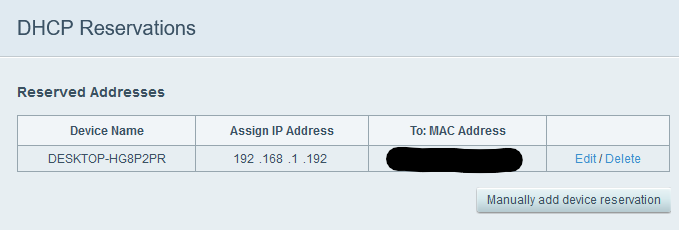
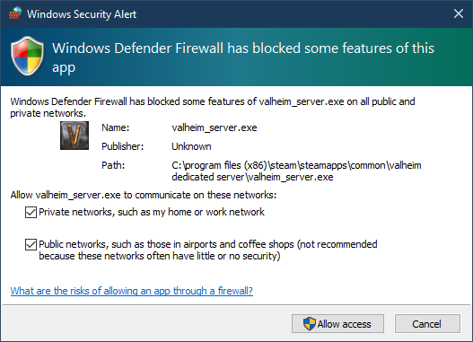

<h1 align="center">Valheim BakaLoader</h1>

  <em>A Windows app that runs your Valheim dedicated server. Start it, keep the mods current, restart on a schedule, see who is online, and look at a map of your actual world.</em> 
  Free, self-hosted on your own PC, no command line. Works with Valheim 1.0.

  
  
  
  
  

  <a href="https://github.com/RyanDMcAfee/ValheimBakaLoader/releases/latest"><b>Download the latest release</b></a>, unzip it anywhere, run <code>ValheimBakaLoader.exe</code>. A short setup wizard runs the first time.

  

> Fan-made. Not affiliated with Iron Gate or Coffee Stain. Use at your own risk, and keep backups of worlds you care about.

---

## Valheim 1.0

Valheim 1.0 shipped on 9 September 2026 and changed a few things that server tools have to keep up with. BakaLoader handles them:

- **Worlds are folders now.** 1.0 stores each world as a folder of files instead of one `.fwl` and one `.db`. The first time a 1.0 server saves an older world it converts it and keeps the old files as a backup. That conversion is one way: an older server cannot read the converted world. BakaLoader lists and backs up both formats side by side.
- **A warning before the first launch on a new build.** When the server on disk is a different build than the one BakaLoader last started, it stops and asks before starting, and offers to back up every world first. Automatic starts and restarts wait for you instead of running unattended. If Steam has a server update queued but not installed yet, it tells you that too, because an old server refuses updated players.
- **Admin, ban and allow lists changed format.** 1.0 only matches Steam ids written as `V_<steamid>`. Old files with bare ids stop working, which looks like everyone being banned. BakaLoader writes both forms and upgrades your existing lists the first time it touches them.
- **PlayStation 5 and Switch 2 players** show up in the roster like everyone else.
- The map generator follows the 1.0 Deep North terrain, and the log reader understands the new save messages.

If you run mods, expect some of them to need updates from their authors. BakaLoader shows what is current on Thunderstore.

---

## What it does

The app is split into nine screens. Each has a plain name, with its Norse name shown underneath as a small caption. A "Show Norse names" switch in Upkeep hides the captions if you want plain labels only. A header on every screen shows the active server, its state, uptime and players online, with one Start or Stop button.

| Screen | What it is for |
|---|---|
| **Dashboard** (Hearth) | Server status, who is online, next save, network addresses, CPU and RAM, a tail of the log, and the Upkeep settings. |
| **Players** (Vikings) | A sortable table with platform, session time, total playtime, last seen, deaths and position. The row button or a right-click opens the actions: promote, allow, kick, ban, heal, teleport or spawn items nearby. |
| **Mods** | Scans your BepInEx folder against Thunderstore. Update one, update all, or paste a Thunderstore link to install. |
| **Settings** (World) | Server name, password, port, world and seed, crossplay, backups, world modifiers, restart rules, RCON and folders. |
| **Map** (Atlas) | Your world drawn from its seed with no map mods, fog of war from what players have shared at cartography tables, portals and builds as layers, and a weather forecast. |
| **Configs** (Runes) | Edit your mods' config files in the app. |
| **Log** (Saga) | The live server log with levels, search, pause on scroll, and a console line. |
| **Discord** (Herald) | One status post in a Discord channel that edits itself as the server changes. |
| **Statistics** (Skald) | Uptime, sessions, deaths and mod history, counted on your machine only. |

### Running the server
- Start, stop and restart from the app. Scheduled restarts warn players in game first. Optional restart when the last player leaves, and relaunch after a crash.
- The server process is tied to the app, so it cannot linger after BakaLoader closes, even through Task Manager or a crash. If a matching server is already running when you open BakaLoader, it offers to adopt it.
- Closing the app while players are online asks first, then saves the world on the way out.
- Copy your public address, LAN address or crossplay join code from the dashboard. Minimize to the tray if you want it out of the way.
- Conditions that stay true, such as a server update waiting, a held start, a failed backup or a crash with a relaunch pending, sit in a bar above the page with their action until you deal with them. Toasts are only used to confirm what you just did.

### More than one server
Each server has its own profile. Profiles can be fully isolated with their own install, mods and save folder. Switching is one click in the sidebar. The new-server wizard picks a free port and warns about collisions before they happen. Orphaned worlds from an old setup can be adopted by copying them; your originals stay where they are.

### Backups
The World Saves card and the Barrow list every backup layer for every world: the game's automatic snapshots, the copies BakaLoader takes before a restore, and the pre-1.0 originals the game keeps after converting a world. Restore any layer with one click. Nothing is deleted without asking.

---

## Quick start

1. Download the latest release, unzip it, run `ValheimBakaLoader.exe`. The wizard finds your Valheim Dedicated Server install and your worlds.
2. On the World screen give the server a name and a password. The default port is fine for most people.
3. Pick an existing world, or type a new name (you can choose a seed).
4. Choose how people join. Listing it as a community server puts it in the in-game browser. Crossplay lets anyone on any platform join with a code.
5. Press Start. When the status says Running, copy your address or code and send it to your friends.

Friends outside your network usually need the server's UDP ports forwarded on your router and allowed through Windows Firewall. The wizard shows which ports.

<table width="100%">
  <tr>
    <td width="50%"></td>
    <td width="50%"></td>
  </tr>
</table>

### Remote control
In-game broadcasts, the restart countdown, and the player actions use RCON through a small server-side plugin that BakaLoader installs when you first need it. Everything else works without any plugin.

---

## A look inside

<table width="100%">
  <tr>
    <td width="50%" valign="top">
      
      
<strong>Map.</strong> The world drawn from the seed, with fog of war and a forecast.

    </td>
    <td width="50%" valign="top">
      
      
<strong>Players.</strong> Who is on, from where, for how long, and a menu for the rest.

    </td>
  </tr>
  <tr>
    <td width="50%" valign="top">
      
      
<strong>Mods.</strong> Thunderstore scan, one-click updates, paste a link to install.

    </td>
    <td width="50%" valign="top">
      
      
<strong>Settings.</strong> Everything the server is started with, in one form.

    </td>
  </tr>
  <tr>
    <td width="50%" valign="top">
      
      
<strong>Log.</strong> The live log with the noise filtered out and a console line.

    </td>
    <td width="50%" valign="top">
      
      
<strong>Command palette.</strong> <kbd>Ctrl</kbd>+<kbd>K</kbd> anywhere: restart, kick, broadcast, save.

    </td>
  </tr>
</table>

---

## Requirements

- Windows 10 or 11, 64-bit.
- [.NET 6 Desktop Runtime](https://dotnet.microsoft.com/download/dotnet/6.0). Windows prompts you on first run if it is missing.
- Valheim Dedicated Server, free in your Steam library under Tools. The wizard can point at any install, including one managed by SteamCMD.

---

## Security and privacy

This is a program that starts a server process, edits files in your Valheim folders, and talks to a few services. Here is exactly what it touches so you can decide for yourself.

**Network connections it makes**
- `thunderstore.io` to read the mod index and download mod files you asked for.
- `api.github.com` and GitHub release downloads to check for and fetch BakaLoader updates.
- Your own Discord webhook, only if you set one up on the Discord screen.
- An anonymous heartbeat to a small stats endpoint, about every 5 minutes while the app is open: a one-way hashed device id, the app version, and whether a server is running. No addresses, names, passwords, world data or player data. Turn it off in Upkeep with "Share anonymous usage stats".

**Files it writes**
- Its own settings and logs under `%USERPROFILE%\AppData\LocalLow\BakaLoader\ValheimBakaLoader\`.
- Your server's BepInEx folders when you install, update or remove mods, and the admin, ban and allow lists when you use the player actions.
- Backups and restores inside your Valheim save folder, always as copies, never in place.

The source is in this repository and every release is built from it. If Windows SmartScreen warns you on first run, that is because the release is not code-signed; check the download against the release page and decide.

---

## When something goes wrong

- **Logs** are in `%USERPROFILE%\AppData\LocalLow\BakaLoader\ValheimBakaLoader\logs\`. Application logs are per day, server logs are per session. You can change the folder on the Saga screen.
- **The server will not start after a game update.** Steam may still have the update queued. Let Steam finish, then start again. BakaLoader tells you when it can see a pending update.
- **Players see "incompatible version".** Client and server are on different builds. Update whichever is behind.
- **Everyone is refused as banned after 1.0.** Your allow list has old-style ids. Open the Players screen once and BakaLoader adds the new form, or edit the file and prefix Steam ids with `V_`.
- **Something else.** Open an issue with the log lines around the problem, or post in Discussions.

## Questions people ask

- **Linux or Docker?** Not yet. BakaLoader is a Windows app built around the Windows server binary.
- **Do console players need anything?** No. They join a crossplay server with the code. Mods that need a client-side part will not work for them.
- **Does it update Valheim itself?** No. Steam or SteamCMD does that. BakaLoader watches for it and protects your worlds around it.

## Mod authors

If you want your mod's items in the spawn picker or its config handled better, open an issue with the Thunderstore link. BakaLoader is a solo project and does not take code contributions.

## License

Free to download and use under the BakaLoader Source-Available License: run it for any server, personal or community, and read the source. Redistribution and derivative works are not permitted. See [LICENSE](LICENSE).

Valheim is a trademark of Iron Gate AB. This is an independent, unofficial tool.
